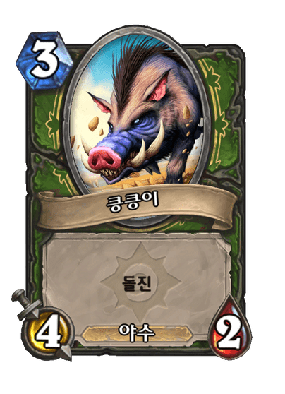
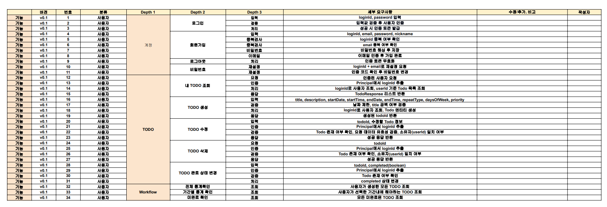
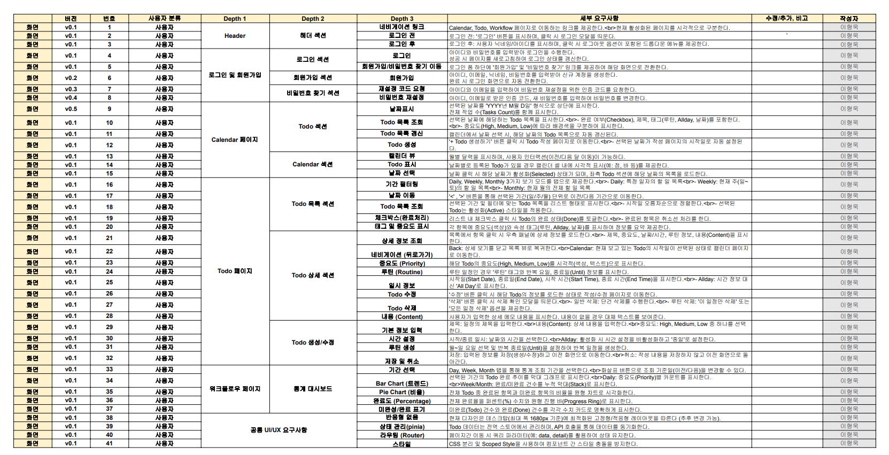
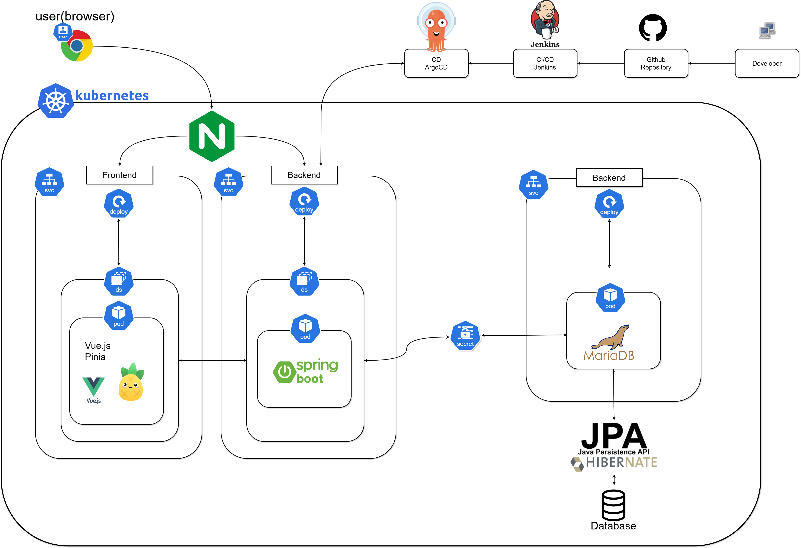
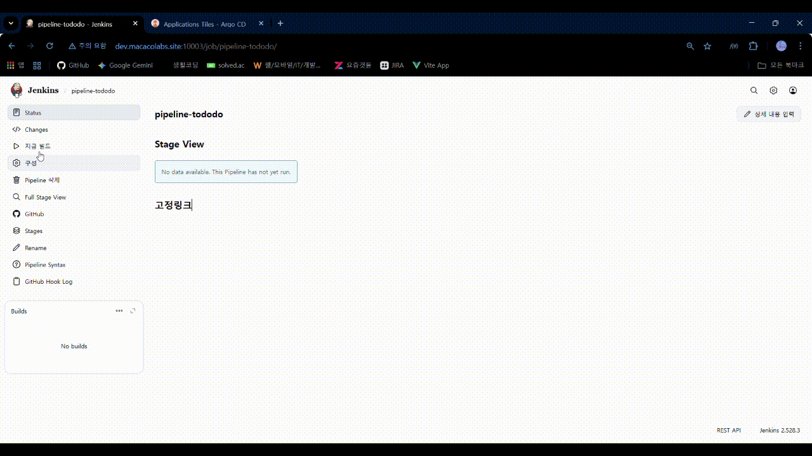
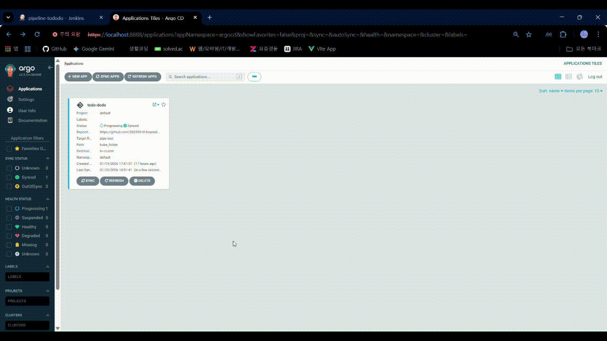
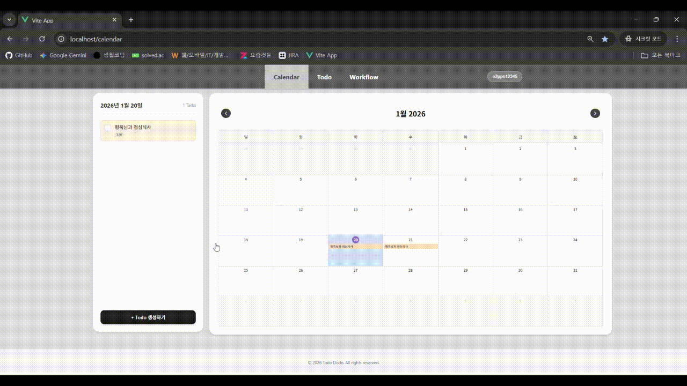

# ✅ Todo-dodo

**Todo-dodo**는 이슈 기반의 Todo / Task 관리 프로젝트입니다.  
단순 체크리스트를 넘어, 작업(Task)과 이슈(Issue) 중심으로 업무 흐름과 상태를 구조적으로 관리하는 것을 목표로 합니다.

---
## 👥 팀원 소개

|                **이용우 (Back-end)**                 |               **정재우 (Back-end)**               |               **윤홍석 (Back-end)**               |
|:-------------------------------------------------:|:----------------------------------------------:|:----------------------------------------------:|
|  |  |  |
|                     **안녕로봇**                      |                    **야유로봇**                    |                  **파멸의 예언자**                   |

| **이형욱 (Front-end)** | **임재열 (DevOps)** |
|:---:|:---:|
|  |  |
| **험상궂은 손님** | **킁킁이** |

## 🧩 프로젝트 개요
* **계층적 작업 관리:** Todo → Task → Issue 구조 기반의 체계적 설계
* **워크플로우 최적화:** 상태 기반 진행 흐름 관리 (TODO / DONE)
* **확장 가능한 구조:** 개인 및 협업 환경 모두를 고려한 설계

## 🎯 기획 배경
기존의 일반적인 Todo List는 할 일을 나열하고 체크하는 것에만 초점이 맞춰져 있어 다음과 같은 한계가 있었습니다.
1. **맥락(Context) 부족:** 작업의 발생 원인이나 상세 배경 파악이 어려움
2. **진행 흐름 추적 불가:** 단순 완료 여부 외에 세부적인 상태 추적이 힘듦
3. **관리 효율 저하:** 연관된 작업을 이슈 단위로 묶어서 관리하기 어려움

**Todo-dodo**는 이를 해결하기 위해 **이슈 중심의 관리 구조**를 도입했습니다.

## ✨ 핵심 기능
* 📝 **이슈 및 작업 관리:** Todo / Task / Issue 생성 및 상세 조회
* 🔄 **상태 관리:** 진행 단계별 상태 업데이트 및 가시성 확보
* 🧠 **워크플로우 제어:** 이슈 단위의 구조적인 작업 흐름 관리
* 👤 **사용자 맞춤형 관리:** 사용자별 작업 분리 및 독립적인 관리 환경

## 🛠️ 기술 스택

### Backend
- **Language:** Java 17
- **Framework:** Spring Boot
- **Database:** MariaDB

### Frontend
- **Framework:** Vue.js 3
- **Build Tool:** Vite
- **State Management:** Pinia
- **HTTP Client:** Axios

### DevOps
- **Container:** Docker
- **CI/CD:** Jenkins

## 🗂️ 프로젝트 구조

```text
todo-dodo
├── todo-dodo (Backend)
│   ├── src/main/java/com/team3/todododo
│   │   ├── common       # 공통 유틸리티 및 설정
│   │   └── domain       # 핵심 비즈니스 로직 (Controller, Service, Repository, Entity)
│   └── src/main/resources
│       └── application.yml
│
└── todo-dodo-frontend (Frontend)
    ├── src
    │   ├── api          # API 연동 로직
    │   ├── components   # 공통 컴포넌트
    │   ├── feature      # 기능별 모듈
    │   │   ├── calendar   # 캘린더 관련 기능
    │   │   ├── statistics # 통계 관련 기능
    │   │   └── todo       # 할 일 관리 기능
    │   ├── router       # 라우터 설정
    │   └── stores       # Pinia 상태 관리
    ├── index.html
    ├── package.json
    └── vite.config.js
    └── README.md
    └── .gitignore
```

---
##  📄 프로젝트 문서
> [해당 프로젝트 문서 시트는 여기에서 확인하실 수 있습니다.](https://docs.google.com/spreadsheets/d/1fb9Lt01XtIq5lV3uXO4cThacHsvjYkBA/edit?gid=211153118#gid=211153118)

## 📋 요구사항 정의 (Requirements)

프로젝트의 안정적인 구현을 위해 기능 및 비기능 요구사항을 상세히 정의하였습니다. 

### 🔹 Backend 요구사항
[](./assets/백엔드_요구사항_정의서.pdf)

---

### 🔹 Frontend 요구사항
[](./assets/프론트_요구사항_정의서.pdf)

## 🏗️ 빌드 및 배포

### 🔹 Architecture 다이어그램


### 🔹 Pipeline 빌드 과정


### 🔹 ArgoCD 배포 동기화


### 🔹 프론트엔드 화면


---

## 🚀 추후 개발 방향성

현재 프로젝트는 핵심 기능의 프로토타입 구현에 집중하였으며, 향후 다음과 같은 방향으로 시스템을 확장해 나갈 예정임.

### 1. 계층적 작업 관리의 고도화 (Hierarchy Task Management)
- **현황**: `Todo` / `Task` / `Issue`의 계층적 구조 중, 현재는 실행 단위인 **`Todo`** 기능이 구현되어 있습니다.
- **개선 계획**: 
  - `Issue` (큰 단위의 목표) ➡️ `Task` (중간 단위 작업) ➡️ `Todo` (실행 단위)로 이어지는 **3단계 계층 구조**를 완성합니다.
  - 이를 통해 단순 할 일 관리를 넘어, 프로젝트 단위의 거시적인 업무 관리가 가능하도록 개선할 예정입니다.

### 2. 협업 환경 및 확장성 강화 (Scalable Architecture for Team)
- **현황**: **개인 사용자(Personal)** 를 위한 독립적인 작업 관리 환경은 구현이 완료되었습니다.
- **개선 계획**:
  - **다중 사용자(Multi-user) 및 협업(Collaboration)** 기능을 도입합니다.
  - 팀 단위의 워크스페이스를 구축하여 이슈를 공유하고, 공동으로 작업을 관리할 수 있는 환경을 제공할 예정입니다.

---

## 회고록

### 📝 정재우
프로젝트의 관문인 보안과 인증 시스템을 전담하며 데이터 보호의 중요성을 깊이 체감했습니다. 
Spring Security를 통한 로그인 구현에 그치지 않고, DevOps 파이프라인이 구축되는 과정을 긴밀히 공유하며 
애플리케이션의 배포와 운영 관점에서의 인프라 구조를 폭넓게 이해할 수 있었습니다. 
단순한 코드 작성을 넘어 시스템 전체의 흐름을 고려하는 설계의 중요성을 깨달은 값진 경험이었습니다.

### 📝 이용우
이번 데브옵스 프로젝트를 통해 기획부터 배포까지 팀원들과 완주하며 진정한 협업의 가치를 경험했습니다.

백엔드 개발 과정에서는 Service 계층의 분리와 Todo 엔티티 설계를 주도했습니다. 이 과정에서 단순히 기능을 구현하는 것을 넘어, 발생 가능한 다양한 예외 상황과 데이터의 반복 패턴을 고려하여 확장성 있는 스키마(Schema)를 설계하는 데 집중했습니다.

또한, 제 주 담당 분야는 아니었으나 전체 파이프라인의 이해도를 높이기 위해 CI/CD에 대해 자발적으로 학습했습니다. 이를 통해 인프라 담당자와 기술적인 쟁점에 대해 깊이 있게 소통할 수 있었으며, 부족한 부분은 전문 서적을 통해 보완하며 프로젝트의 완성도를 높이는 데 기여했습니다.

### 📝 이형욱
이번 DevOps 프로젝트에서는 프론트엔드 전반과 UI/UX 디자인을 담당했다. 작업을 병행하면서 구현부터 들어가면 결국 되돌아가게 된다는 걸 체감했고, API 스펙과 기능 흐름을 먼저 설계하고 합의하는 과정이 전체 속도와 품질을 좌우한다는 점을 배웠다. 배포와 CI/CD를 진행하는 과정에서는 담당자를 돕기 위해 프론트엔드 Docker 이미지를 직접 빌드해 Docker Hub에 푸시했는데, 이후 담당자가 해당 이미지를 수정·재빌드할 권한이 없어 CI가 막히는 이슈가 발생했다. 이 경험을 통해 기술적으로는 컨테이너 이미지 태깅/배포 흐름을 이해하게 되었고, 운영 관점에서는 레지스트리 권한, 소유자 관리, 파이프라인 책임 범위를 사전에 정리하는 것이 배포 안정성에 직결된다는 사실을 깨달았다.

### 📝 임재열
이번 DevOps 프로젝트에서 DevOps파트를 담당하며 느낀점은 
미리 아키텍처의 구조를 파악하고 개발을 해야한다는것을 뼈저리게 느꼈다. 
팀원들이 프론트 , 백엔드 작업을 담당하고 나는 devops 담당했는데 배포만 하면될줄알고 아키텍처 구조를 유심히 보지않았다.  그랬더니 나중에 오류가 날때 오류를 쉽게 고칠 수 없었다 . 
환경 분리의 중요성: Jenkins(서버 PC)와 K8S(로컬 Docker Desktop)가 분리되어 있어 디버깅이 복잡했다....
Secret 관리: 민감정보를 Git에 템플릿으로 두고 CI [젠킨스 credential] 에서 치환하는 방식이 보안상 좋을줄 알았으나 이후 설정파일들이 ArgoCD처리과정에서 ArgoCD와 충돌할 수 있다는것을 알았다. 
Probe 설정: Spring Security가 적용된 앱은 HTTP Probe 대신 TCP Probe를 사용하거나, health 엔드포인트를 인증에서 제외해야 한다는것을 알았다 . 
무한 루프 방지: 젠킨스 배포중에 break 를 걸지않아서 무한정으로 파이프라인 빌드를 하였다 . CI가 자동 커밋하는 구조에서는 반드시 스킵 로직이 필요하다는것을 알았다.
캐시 문제: 프론트엔드 배포 후 문제가 생기면 브라우저 캐시부터 의심하자는걸 깨달았다.
마지막으로 고생해준 팀원들도 감사하고 CI/CD 전 과정의 흐름을 알 수 있어서 너무 좋은 경험이였다.

### 📝 윤홍석
이번 프로젝트에서 저는 백엔드의 워크플로우 파트를 맡아, 사용자 활동 데이터를 통계로 시각화하는 기능을 구현했습니다.

구현 과정에서 TODO 엔티티와 Repository가 필수적이었으나, 해당 도메인은 다른 팀원이 담당하고 있었습니다. 그 팀원과의 적극적인 소통을 통해서 팀원이 설계 중인 엔티티 구조를 미리 공유받아 이를 바탕으로 임시 서비스 계층을 구축했습니다. 덕분에 실제 데이터 모델이 나온 후에도 최소한의 수정만으로 기능을 통합할 수 있었습니다. 이를 통해 협업에서 사전 소통이 개발 효율성에 미치는 중요성을 다시금 깨달았습니다.

처음 합을 맞추는 팀원들이었음에도 불구하고, 활발한 소통과 빠른 피드백 덕분에 프로젝트를 원활하게 진행할 수 있었습니다. 특히 데브옵스 총괄 팀원의 뛰어난 역량 덕분에 평소 궁금했던 인프라 지식을 배우며 함께 성장할 수 있었던 소중한 경험이었습니다.